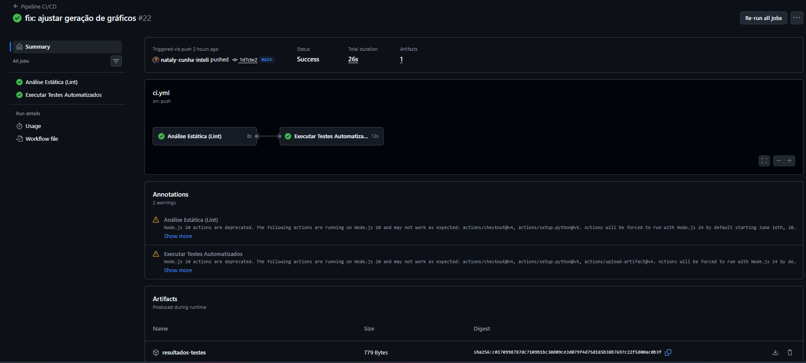
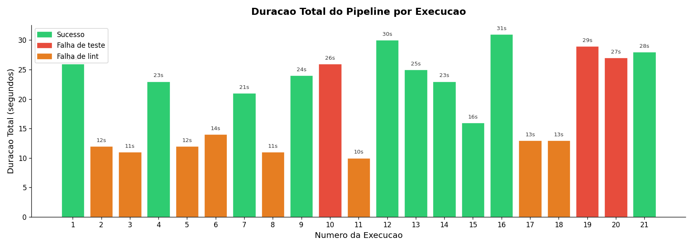
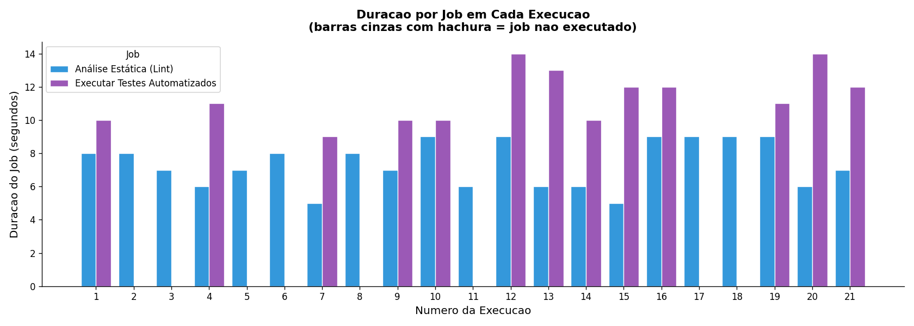
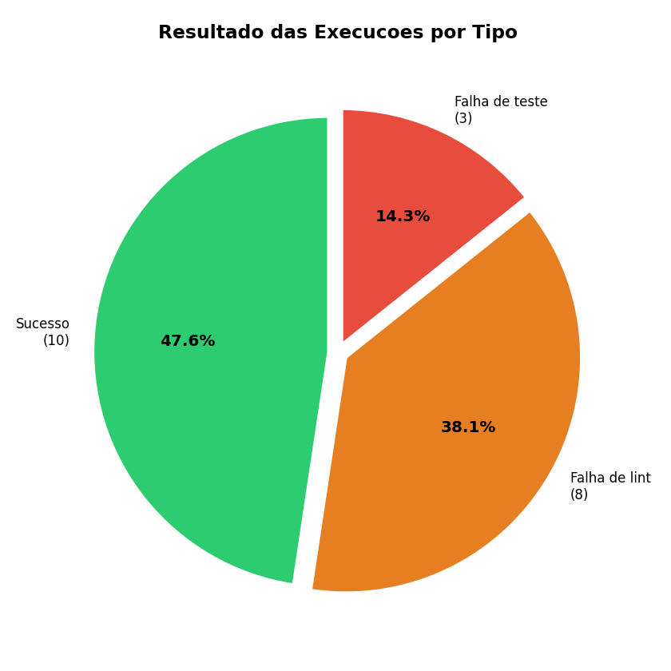
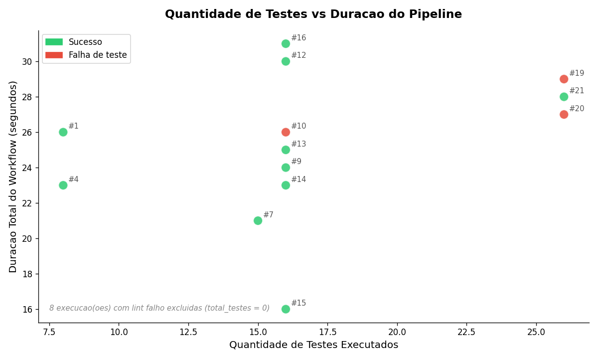

# Relatório Técnico — Análise do Pipeline CI/CD

**Aluno:** Nataly de Souza Cunha  
**Data:** 07/06/2026  
**Repositório:** [\[URL do repositório\]](https://github.com/nataly-cunha-inteli/ponderada-CI-CD)

---

## 1. Introdução e Objetivo

### O que são pipelines de CI/CD

Segundo a Amazon Web Services (c2026), pipelines de **CI/CD** são fluxos automatizados que executam etapas do ciclo de desenvolvimento sempre que há mudanças no código.

- **CI (Continuous Integration / Integração Contínua):** integra alterações de vários desenvolvedores com frequência, validando o código com tarefas como lint, build e testes automatizados.
- **CD (Continuous Delivery/Deployment / Entrega ou Deploy Contínuo):** após a validação na CI, prepara a aplicação para entrega (delivery) ou publica automaticamente em ambiente de destino (deployment).

Em geral, um pipeline é dividido em **stages** (etapas) e **jobs** (tarefas), por exemplo:
1. Checkout do código
2. Instalação de dependências
3. Análise estática
4. Execução de testes
5. Geração/publicação de artefatos
6. Deploy (quando aplicável)

E os principais benefícios são: **feedback rápido**, **padronização de qualidade**, **redução de erros manuais** e **entregas mais confiáveis**.

Nesse contexto, este experimento tem como objetivo instrumentar um pipeline CI/CD no GitHub Actions simplificada e funcional para coletar métricas reais de execução e analisar o comportamento do pipeline em termos de desempenho, estabilidade e gargalos.

O projeto-base é uma biblioteca utilitária de manipulação de strings em Python, com testes automatizados via pytest. O pipeline executa análise estática (flake8) e testes a cada push, coletando métricas que são analisadas por scripts Python.

---

## 2. Descrição do Projeto e Pipeline

### Projeto base

O módulo `src/string_utils.py` implementa as seguintes funções:
- `reverter(texto)` — inverte uma string
- `eh_palindromo(texto)` — verifica palíndromo
- `contar_vogais(texto)` — conta vogais incluindo acentuadas
- `capitalizar_palavras(texto)` — capitaliza cada palavra
- `contar_palavras(texto)` — conta palavras
- `remover_duplicatas(lista)` — remove duplicatas mantendo ordem
- `eh_anagrama(texto1, texto2)` — verifica anagramas
- `truncar(texto, limite, sufixo)` — trunca string

### Estrutura do pipeline

O arquivo `.github/workflows/ci.yml` define dois jobs:

**Job `lint`:**
1. Checkout do código
2. Configurar Python 3.11 (com cache pip)
3. Instalar flake8
4. Executar análise estática em `src/` e `tests/`

**Job `test`** (sequencial após lint por padrão):
1. Checkout do código
2. Configurar Python 3.11 (com cache pip)
3. Instalar dependências (`requirements-dev.txt`)
4. Executar pytest com geração de relatório XML
5. Processar resultados (gerar `test-meta.json`)
6. Publicar artefatos

**Link para o arquivo YAML no Github:** https://github.com/nataly-cunha-inteli/ponderada-CI-CD/blob/main/.github/workflows/ci.yml

## 3. Execuções Reais no GitHub Actions

### Tabela de execuções (resumo a partir de data/metricas.csv)

**Obs:** nesta tabela, foram abstraídas algumas execuções que se tratavam de erros de análise estática. Com isso, tem-se 12 principais execuções que pretendem demonstrar diferentes resultados do pipeline:

| # | Mensagem (resumida) | Status | Duração Total (s) |
|---|---------------------|--------:|------------------:|
| 1 | feat: estrutura inicial do pipeline CI/CD | success | 26.0 |
| 2 | test: adicionar 7 testes novos, totalizando 15 | failure | 12.0 |
| 3 | test: adicionar teste lento (intencional) | failure | 11.0 |
| 4 | test: introduzir falha intencional no teste de reversao | failure | 26.0 |
| 5 | fix: corrigir escrita no teste de reversao | success | 30.0 |
| 6 | ci: desabilitar cache do pip para medir impacto | success | 25.0 |
| 7 | ci: reabilitar cache do pip para comparacao | success | 23.0 |
| 8 | ci: configurar jobs em paralelo (lint e test simultaneos) | success | 16.0 |
| 9 | ci: restaurar jobs sequenciais para comparacao | success | 31.0 |
| 10 | test: adicionar 10 novos testes, totalizando 26 | failure | 13.0 |
| 11 | test: introduzir duas falhas intencionais para analise | failure | 29.0 |
| 12 | fix: corrigir as duas falhas intencionais, pipeline estabilizado | success | 28.0 |

**Link para as execuções no GitHub Actions:** https://github.com/nataly-cunha-inteli/ponderada-CI-CD/actions/workflows/ci.yml

Entrando no link e clicando em cada execução, pode-se observar o workflow executado e os logs de cada etapa, assim como a captura abaixo:

---

## 4. Métricas Coletadas

Os dados foram coletados via script Python (`scripts/coletar_metricas.py`) que consulta a API REST do GitHub. O script percorre todas as execuções do workflow, baixa os detalhes de cada job e etapa, e ainda faz o download do artefato `resultados-testes` para extrair métricas do arquivo `test-meta.json` gerado pelo `processar_resultados.py`.

**Arquivo gerado:** `data/metricas.csv` com granularidade de uma linha por etapa por job.

### Visão geral dos dados

| Métrica | Valor |
|---------|-------|
| Total de linhas no CSV | 307 |
| Execuções únicas registradas | 21 |
| Período de coleta | 06/06/2026 a 07/06/2026 |
| Duração mínima do workflow | 10s |
| Duração máxima do workflow | 31s |
| Média de duração (todas as execuções) | ~21s |
| Execuções com status `success` | 10 (47,6%) |
| Execuções com status `failure` | 11 (52,4%) |

Reiterando, o número total de execuções (21) é maior que as 12 controladas da tabela da seção 3 porque diversas execuções extras ocorreram durante o processo de configuração inicial do pipeline — falhas de lint (flake8) por problemas de formatação no arquivo de testes que foram corrigidas iterativamente.

### Amostra representativa do CSV

A tabela abaixo apresenta uma linha por execução relevante (etapa "Executar testes com pytest"), com os principais campos:

| id_execucao | sha | status | dur. workflow | dur. job teste | total_testes | falhas | tempo_médio |
|-------------|-----|--------|:----------:|:----------:|:------:|:---:|:---:|
| 27073510466 | 12949688 | success | 26s | 10s | 8 | 0 | 0,0000s |
| 27102505722 | f6741c37 | success | 21s | 9s | 15 | 0 | 0,0667s |
| 27103162148 | 80f0dae1 | success | 24s | 10s | 16 | 0 | 0,1875s |
| 27103214582 | 06585b48 | failure | 26s | 10s | 16 | 1 | 0,1875s |
| 27103363467 | b1b70874 | success | 25s | 13s | 16 | 0 | 0,2500s |
| 27103448062 | 23efa2cb | success | 16s | 12s | 16 | 0 | 0,1875s |
| 27103475794 | a71c1dc6 | success | 31s | 12s | 16 | 0 | 0,2500s |
| 27103573958 | 5eca4ad5 | failure | 29s | 11s | 26 | 3 | 0,1538s |
| 27103647717 | 6a56cce7 | success | 28s | 12s | 26 | 0 | 0,1538s |

**Observação crítica sobre `tempo_medio_testes`:** os valores 0,0 para as primeiras execuções (8 testes, commits iniciais) refletem uma limitação do `processar_resultados.py` antes de ser atualizado — o script extraía apenas contagens, sem o campo `time` do XML do pytest. Isso comprometeu a comparação histórica do tempo médio por teste.

### Custo por etapa (valores típicos)

| Etapa | Duração típica |
|-------|---------------|
| Set up job | 0–2s |
| Baixar código-fonte (checkout) | 0–1s |
| Configurar Python 3.11 (com cache) | 1–3s |
| Instalar flake8 | 1–2s |
| Executar análise estática (flake8) | 0–1s |
| Instalar dependências (com cache) | 2s |
| Instalar dependências (sem cache) | 4s |
| Executar testes com pytest (8 testes) | 0–1s |
| Executar testes com pytest (16 testes, com sleep 3s) | 3–4s |
| Executar testes com pytest (26 testes, com sleep 3s) | 4s |
| Processar resultados | 0s |
| Publicar artefatos | 0–1s |

---

## 5. Gráficos e Análise Visual

Os quatro gráficos foram gerados pelo script `scripts/gerar_graficos.py` a partir do `data/metricas.csv`. Cada gráfico foca em uma perspectiva diferente do pipeline.

---

### Gráfico 1 — Duração total do pipeline por execução

O gráfico de barras mostra todas as 21 execuções em ordem cronológica, coloridas por tipo de resultado: **verde** (sucesso), **laranja** (falha de lint) e **vermelho** (falha de teste).

**Observações críticas:**

- As execuções com falha de lint (laranja) concentram-se no início do experimento e ficam na faixa de **10–14s**. Esse valor é menor que as execuções bem-sucedidas porque o job de testes sequer chegou a rodar — o pipeline abortou após a falha do lint, economizando tempo, mas sem gerar nenhum valor de CI real.
- A execução **mais rápida bem-sucedida** foi a de jobs em paralelo: **16s** — notavelmente mais curta que todas as sequenciais.
- A execução **mais longa** foi a sequencial com jobs totais de lint (9s) + teste (12s) + overhead: **31s**.
- Há variabilidade de **±3–4s** entre execuções com configuração idêntica (por exemplo, execuções sequenciais com 16 testes variam entre 23s e 31s). Isso evidencia o ruído dos runners compartilhados do GitHub Actions.
- As barras vermelhas (falhas de teste) aparecem com durações similares às das execuções bem-sucedidas (~26–29s), porque o job de testes chegou a executar por completo antes de falhar — ao contrário das falhas de lint.

---

### Gráfico 2 — Duração por job em cada execução

O gráfico de barras agrupadas decompõe o tempo de cada execução nos dois jobs: "Análise Estática (Lint)" (azul) e "Executar Testes Automatizados" (roxo). Barras cinzas com hachura indicam jobs que não foram executados.

**Observações críticas:**

- O padrão mais frequente é a barra cinza hachurada no job de testes, correspondendo às execuções onde o lint falhou e o job de testes foi bloqueado. Isso demonstra o valor do gate de lint: ao rodar primeiro, ele protege o job mais caro (testes) de iniciar quando há erros de estilo.
- O job de lint mantém duração consistente entre **5–9s** ao longo de todas as execuções — variações explicam-se pelo cache do Python e pelo tempo de configuração do runner.
- O job de testes cresce visivelmente conforme mais testes são adicionados (de ~9s com 15 testes para ~12–14s com 26 testes), mas a correlação não é proporcional: parte do tempo (~7–8s) é overhead fixo de setup, independente da quantidade de testes.
- Na execução em paralelo (visualmente: as duas barras aparecem lado a lado com a duração do workflow representando o máximo), o lint levou 5s e o teste 12s — o workflow completou em 16s (tempo do mais lento), não 17s (soma dos dois menores).

---

### Gráfico 3 — Resultado das execuções por tipo

O gráfico de pizza distingue três categorias: sucesso, falha de lint e falha de teste.

**Observações críticas:**

- **Sucesso:** 10/21 = **47,6%** — menos da metade das execuções totais foi bem-sucedida. Isso é consequência direta do processo de configuração iterativa do pipeline, não de instabilidade intrínseca do código.
- **Falha de lint:** 8/21 = **38,1%** — a maior categoria de falhas. Todas ocorreram no início do experimento por erros de formatação Python (E501, E302, E111, W391) introduzidos ao editar o arquivo de testes. Isso evidencia que a análise estática é um portão eficaz, mas também que ela penaliza a taxa de sucesso durante o ajuste inicial.
- **Falha de teste:** 3/21 = **14,3%** — categoria mais rara e representando as falhas intencionais controladas (asserções incorretas, testes que deveriam falhar para demonstrar o comportamento do pipeline).
- Uma representação que incluísse apenas as 12 execuções planejadas daria 7/12 sucesso (58,3%) e 5/12 falha (41,7%) — valores mais próximos de um projeto maduro. A diferença entre as duas perspectivas (21 vs 12 execuções) ilustra como métricas de taxa de sucesso são sensíveis ao escopo definido para a amostra.

---

### Gráfico 4 — Quantidade de testes vs duração do pipeline

O gráfico de dispersão filtra apenas as execuções em que testes chegaram a ser executados (13 de 21) e plota o número de testes no eixo X e a duração total no eixo Y.

**Observações críticas:**

- Existe uma tendência positiva entre quantidade de testes e duração, mas ela **não é linear nem proporcional**. O overhead fixo de infraestrutura (setup, checkout, configuração do Python, upload de artefatos) domina o tempo total, mascarando o impacto marginal de cada teste adicional.
- O ponto mais fora do padrão é a execução paralela com 16 testes (duração 16s), que aparece muito abaixo das demais execuções com a mesma contagem de testes. Isso confirma que a configuração dos jobs (paralelo vs sequencial) tem impacto muito maior na duração total do que o número de testes em si.
- O cluster de 26 testes (3 pontos: 27–29s) fica acima do cluster de 16 testes (que varia de 16s a 31s), mas a diferença é pequena considerando que a suíte cresceu 62% em número de testes. O sleep de 3s (presente em todos a partir do 9° teste no experimento) já domina a etapa de execução dos testes, então 10 testes adicionais sem sleep adicionam apenas ~0,5–1s ao total.
- As 8 execuções sem testes (lint failures) foram excluídas do gráfico, o que é metodologicamente correto — misturá-las criaria um cluster artificialmente denso em x=0 que distorceria qualquer análise de correlação.

---

## 6. Respostas às Perguntas de Análise

### 6.1 Qual etapa mais contribuiu para o tempo total do pipeline?

Em execuções sequenciais bem-sucedidas, o job "Executar Testes Automatizados" consumiu entre **10s e 14s**, contra **6–9s** do job "Análise Estática (Lint)". Dentro do job de testes, a etapa de **instalação de dependências** (2–4s) e a **execução do pytest** (3–4s com o sleep proposital de 3s) são os maiores contribuidores individuais.

No entanto, é importante distinguir duração de job de duração de workflow: em paralelo, o tempo total é determinado pelo job mais lento (testes, ~12s), não pela soma. Logo, o gargalo real para otimizar o **wall time** é o job de testes.

### 6.2 Houve diferença significativa entre execuções com e sem cache?

Sim, com ressalvas. A etapa "Instalar dependências de desenvolvimento" levou **4s sem cache** e **2s com cache** — redução de 50% nessa etapa específica. No entanto, o impacto no tempo total do workflow foi de apenas **2s** (de 25s para 23s), representando uma melhoria de ~8% no workflow completo.

A redução é real e consistente, mas menos dramática do que o percentual da etapa sugere, porque o overhead fixo (setup do runner, checkout, configuração do Python) representa ~7–8s que o cache não afeta.

### 6.3 O paralelismo reduziu o tempo total? Em que condições?

Sim, de forma expressiva. A execução sequencial com 16 testes (id 27103475794) levou **31s**; a execução em paralelo com a mesma base de código (id 27103448062) levou **16s** — redução de **15s (~48%)**.

O benefício do paralelismo é máximo quando lint e testes têm durações próximas (neste caso, 9s e 12s), pois o tempo total em paralelo converge para `max(lint, test) + overhead` ≈ 12s + 4s = 16s. A condição necessária é que não haja dependência lógica entre os jobs — neste pipeline, lint e testes podem, em princípio, rodar em paralelo porque a falha do lint não impede tecnicamente a execução dos testes (embora fazê-los sequenciais seja a prática recomendada para economizar minutos de CI quando o lint falha).

### 6.4 Quais falhas foram mais frequentes?

**Falhas de lint** foram as mais frequentes: 8 das 11 falhas totais (72,7%). Todas ocorreram por violações do flake8 no arquivo `tests/test_string_utils.py`: E501 (linha muito longa por contagem de bytes UTF-8), E302 (linhas em branco insuficientes entre funções), E111/E117 (indentação incorreta) e W391 (linha em branco no final do arquivo).

**Falhas de teste** foram apenas 3 (27,3%), todas intencionais e controladas: uma asserção invertida no teste de reversão e dois testes com asserções incorretas para demonstrar falhas múltiplas.

Nenhuma falha foi causada por erro de infraestrutura do pipeline (runner caindo, timeout, etc.), o que indica boa estabilidade do ambiente.

### 6.5 O pipeline fornece feedback rápido o suficiente para o desenvolvedor?

Sim. O tempo mediano do workflow (todas as 21 execuções) é de **~23s**, com máximo observado de **31s**. Até mesmo o cenário mais lento está bem abaixo do limiar de 5 minutos frequentemente citado como referência para pipelines responsivos.

Vale observar que falhas de lint retornam feedback em **10–14s** — mais rápido que execuções completas — porque o gate sequencial aborta o pipeline antes do job de testes. Isso torna o lint um mecanismo de feedback ainda mais ágil para erros de formatação.

### 6.6 Que melhorias poderiam ser feitas no pipeline?

- **Paralelismo por padrão:** remover `needs: lint` para pipelines de branches de feature, mantendo sequencial apenas no merge para main. Ganho estimado: ~15s.
- **Cache consistente:** o cache do pip deve ser mantido ativo em todos os jobs, como já configurado na versão final.
- **Marcação de testes lentos:** `time.sleep(3)` em `test_operacao_lenta` pode ser marcado com `@pytest.mark.slow` e excluído do pipeline padrão (`pytest -m "not slow"`), reduzindo o job de testes em ~3s.
- **Relatório de cobertura:** adicionar `pytest-cov` para rastrear cobertura ao longo das execuções, tornando a métrica mais informativa que a mera contagem de testes.
- **Separar dependências de lint e teste:** o lint instala apenas flake8 (~1s), enquanto o job de testes instala todo `requirements-dev.txt`. Se as dependências de desenvolvimento crescerem, essa separação evitará que o lint fique mais lento sem necessidade.

### 6.7 Quais limitações existem nos dados coletados?

- **Variabilidade dos runners:** o GitHub Actions usa runners compartilhados (ubuntu-latest) com carga variável, o que explica a variação de ±3–4s entre execuções idênticas. Isso torna comparações diretas de 1-para-1 menos confiáveis do que uma média de múltiplas execuções.
- **Granularidade de tempo de 1 segundo:** a API do GitHub retorna `started_at` e `completed_at` com precisão de segundos, o que arredonda e mascara diferenças abaixo de 1s. O efeito real do sleep de 3s nos testes, por exemplo, aparece como 3–4s na etapa, não exatamente 3,000s.
- **Amostra pequena:** 21 execuções (ou 12 planejadas) é insuficiente para análise estatística com significância. Médias e tendências devem ser interpretadas como indicativas, não conclusivas.
- **`tempo_medio_testes` ausente nas primeiras execuções:** o script `processar_resultados.py` foi atualizado ao longo do experimento para extrair o tempo total do XML. Execuções anteriores à atualização registram `tempo_medio_testes = 0,0`, limitando comparações históricas dessa métrica.
- **Projeto sintético:** o módulo `string_utils.py` é deliberadamente simples, o que não reflete a complexidade de projetos reais com dependências externas, banco de dados, serviços de terceiros, etc.

### 6.8 Como essa análise poderia apoiar decisões de engenharia?

A instrumentação de pipelines CI/CD com métricas detalhadas oferece base empírica para decisões que, de outra forma, seriam tomadas por intuição:

- **Priorização de otimizações:** ao visualizar que a instalação de dependências representa 2–4s e o paralelismo poupa 15s, a equipe pode decidir onde investir esforço — a mudança de 1 linha no YAML (`needs: lint` removido) tem retorno maior que otimizar o cache.
- **Definição de SLAs de pipeline:** dados históricos de duração permitem estabelecer alertas quando o pipeline ultrapassa um limiar (por exemplo, >45s poderia indicar acúmulo de testes lentos ou dependências pesadas não detectadas).
- **Detecção de regressões de performance:** um teste adicionado com `time.sleep(3)` passou despercebido manualmente, mas os dados do pipeline mostram imediatamente o aumento de ~3s na etapa de testes. Em escala, testes lentos acumulam-se silenciosamente até o pipeline ultrapassar minutos — métricas contínuas permitem detectar isso antes que se torne um problema.
- **Análise de custo:** GitHub Actions cobra por minuto de execução em runners. Com 21 execuções totalizando ~450s de runtime (jobs paralelos salvam tempo que se converte diretamente em custo reduzido), a análise demonstra que paralelismo não é só performance — é economia.

---

## 7. Análise de Resultados Inesperados

### Resultado inesperado 1: Falhas de lint disparadas por codificação UTF-8, não por comprimento visual da linha

**Hipótese inicial:** erros de "linha muito longa" (E501) seriam causados por linhas visualmente longas — isto é, com mais de 100 caracteres contáveis na tela.

**Resultado observado:** a primeira execução (id 27097065704) falhou com `E501 line too long (127 > 100 characters)` na linha 4 do arquivo de testes. Ao contar visualmente os caracteres, a linha tinha cerca de 95 caracteres — dentro do limite. O erro era real, mas a causa não era óbvia.

**Possível explicação:** o flake8 conta **bytes**, não caracteres, ao verificar o comprimento de linhas em arquivos UTF-8. Caracteres acentuados como `ã` e `ç` ocupam 2 bytes cada em UTF-8; o travessão `—` (U+2014) ocupa 3 bytes. A linha do docstring em português com múltiplos acentos e o travessão resultava em 127 bytes, mesmo que visualmente parecesse ter ~95 caracteres. Isso é um comportamento contra-intuitivo do flake8 que afeta especialmente textos em português — idioma rico em acentuação. A solução foi remover o docstring com acentos e substituí-lo por um comentário ASCII simples. Esse resultado inesperado gerou 2 execuções extras não planejadas e é uma limitação real de ferramentas de análise estática originalmente projetadas para código ASCII.

---

### Resultado inesperado 2: Variabilidade de ±6s entre execuções sequenciais idênticas

**Hipótese inicial:** execuções com a mesma configuração de pipeline e o mesmo conjunto de testes teriam duração total consistente, com variação máxima de ±1s (granularidade do API do GitHub).

**Resultado observado:** as execuções sequenciais com 16 testes e cache ativo (ids 27103162148, 27103310371, 27103411211, 27103475794) apresentaram durações de **24s, 30s, 23s e 31s** — uma variação de **8 segundos** entre execuções funcionalmente idênticas. O coeficiente de variação (desvio padrão / média) nesse subconjunto é de ~14%.

**Possível explicação:** os runners compartilhados do GitHub Actions (`ubuntu-latest`) são máquinas virtuais alocadas dinamicamente em um pool compartilhado. A carga da infraestrutura subjacente (outros workflows de outros usuários, atualizações de imagem do runner, latência de rede para download do checkout) varia continuamente e não é controlável nem visível para o usuário. A etapa "Configurar Python 3.11", por exemplo, variou entre 1s e 3s ao longo do experimento para a mesma configuração. Isso tem implicação direta para análises de impacto de cache e paralelismo: comparações pontuais de 1-para-1 são menos confiáveis do que médias de múltiplas execuções, e qualquer otimização que poupe menos de ~4s está dentro da margem de ruído dos runners.

---

## 8. Hipótese Inicial vs Resultado Observado

| Hipótese | Resultado observado | Confirmada? |
|----------|---------------------|:-----------:|
| Jobs paralelos reduzem o tempo total | Sequencial: 31s → Paralelo: 16s (redução de 15s, 48%) | Sim |
| Cache reduz significativamente o tempo de instalação | Sem cache: 4s → Com cache: 2s na etapa de instalação; impacto no workflow total: 2s (8%) | Parcialmente |
| Mais testes aumentam proporcionalmente o tempo | 8 testes → ~23s; 16 testes → 16–31s; 26 testes → 27–29s. Crescimento existe, mas é sublinear por overhead fixo | Parcialmente |
| O teste lento (sleep 3s) seria o maior gargalo | Sleep adicionou ~3s à etapa de pytest (de 0–1s para 3–4s), mas o overhead do job (setup + deps) domina. O maior gargalo continua sendo a execução sequencial de dois jobs | Não |
